# NexusCore — System Design Document

**Version:** 1.0
**Stack:** TypeScript · Node.js 22+ · pnpm workspaces · Docker/Kubernetes

## Table of Contents

1. [High-Level Architecture](#1-high-level-architecture)
2. [API Gateway Design](#2-api-gateway-design)
3. [Auth Service — Complete Design](#3-auth-service--complete-design)
4. [User Service — Complete Design](#4-user-service--complete-design)
5. [Chat Service — Complete Design](#5-chat-service--complete-design)
6. [Notification Service — Complete Design](#6-notification-service--complete-design)
7. [Event-Driven Communication (RabbitMQ)](#7-event-driven-communication-rabbitmq)
8. [Database Design Patterns](#8-database-design-patterns)
9. [Caching Strategy (Redis)](#9-caching-strategy-redis)
10. [Security](#10-security)
11. [Observability](#11-observability)
12. [Deployment](#12-deployment)
13. [Monorepo Structure](#13-monorepo-structure)
14. [Testing Strategy](#14-testing-strategy)
15. [Scaling Roadmap](#15-scaling-roadmap)
16. [Implementation Roadmap](#16-implementation-roadmap)

---

## 1. High-Level Architecture

### 1.1 System Diagram

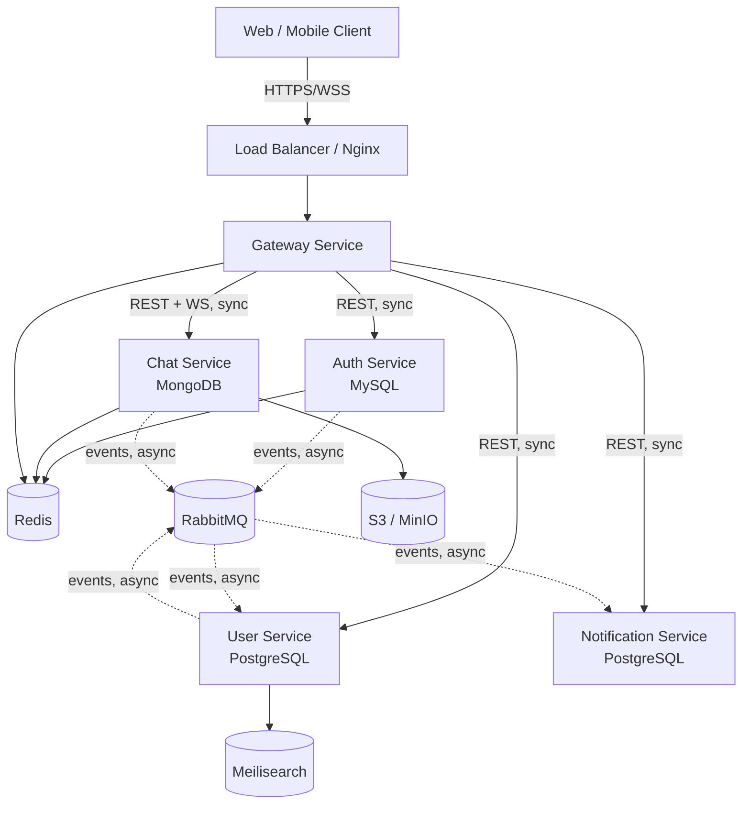

### 1.2 Sync vs Async Communication

| Communication         | When used                                                                                                           | Mechanism                                | Why                                                                                                                   |
| --------------------- | ------------------------------------------------------------------------------------------------------------------- | ---------------------------------------- | --------------------------------------------------------------------------------------------------------------------- |
| Synchronous (REST/WS) | Client-facing requests that need an immediate response (login, fetch profile, send message)                         | HTTP via Gateway, Socket.IO for realtime | Client is waiting; latency must be low and errors must be surfaced immediately                                        |
| Asynchronous (events) | Cross-service side effects that don't block the caller (send welcome email, update search index, push notification) | RabbitMQ topic exchange                  | Decouples services — Auth doesn't need to know Notification exists; failures don't cascade to the user-facing request |

**Rule of thumb used throughout this design:** if the client needs the result to render the next screen, it's synchronous through the Gateway. If it's a downstream side-effect another service cares about, it's an event.

### 1.3 Client → Gateway → Service Flow

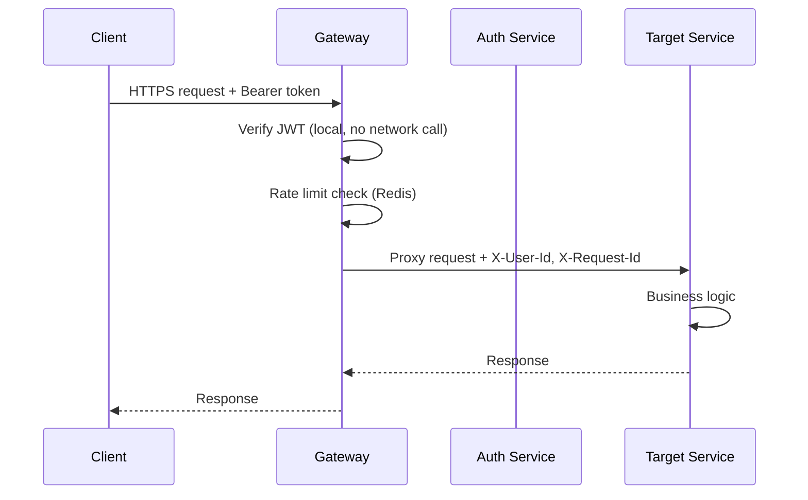

Note the Gateway verifies JWTs **locally** using the shared public key / secret — it does not call the Auth service per-request. This keeps the hot path fast and avoids Auth becoming a single point of failure for every request in the system.

---

## 2. API Gateway Design

### 2.1 Routing Table

| Path Prefix            | Target Service       | Auth Required                            | Notes                         |
| ---------------------- | -------------------- | ---------------------------------------- | ----------------------------- |
| `/api/auth/*`          | Auth Service         | No (public routes: signup/login/refresh) | Rate limited harder           |
| `/api/users/*`         | User Service         | Yes                                      |                               |
| `/api/chat/*`          | Chat Service         | Yes                                      | REST for history, WS for live |
| `/socket.io/*`         | Chat Service         | Yes (JWT in handshake)                   | Sticky sessions required      |
| `/api/notifications/*` | Notification Service | Yes                                      |                               |
| `/health`, `/ready`    | Gateway itself       | No                                       | K8s probes                    |

### 2.2 JWT Verification Flow

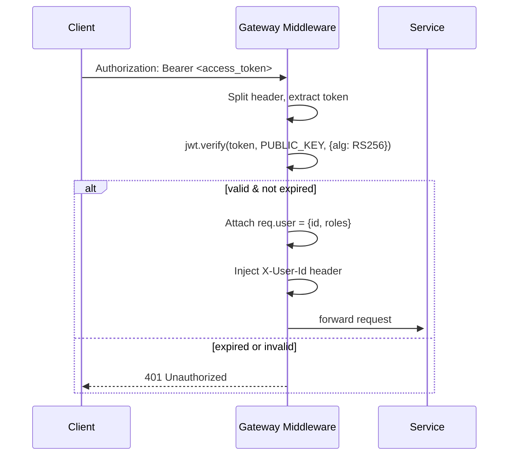

Access tokens are signed **RS256** so the Gateway only needs the Auth service's **public key** — it can verify tokens without ever holding a secret that could mint new ones.

### 2.3 Rate Limiting Strategy

- **Per-IP** (unauthenticated routes like `/auth/login`, `/auth/signup`): sliding window, 10 req / min, Redis `INCR` + `EXPIRE`.
- **Per-user** (authenticated routes): token-bucket, 100 req / min, keyed by `req.user.id`.
- **Per-endpoint override**: sensitive endpoints (`/auth/forgot-password`, `/auth/verify-email`) get a tighter 3 req / 15 min limit regardless of the general bucket.

```ts
// gateway/src/middleware/rateLimit.ts
import { redis } from '../lib/redis';

export function rateLimit(bucket: string, limit: number, windowSec: number) {
  return async (req, res, next) => {
    const key = `rl:${bucket}:${req.user?.id ?? req.ip}`;
    const count = await redis.incr(key);
    if (count === 1) await redis.expire(key, windowSec);
    if (count > limit) {
      res.setHeader('Retry-After', windowSec.toString());
      return res.status(429).json({ error: 'rate_limited' });
    }
    next();
  };
}
```

### 2.4 Request ID Propagation

Every request gets a `X-Request-Id` (UUID v4) at the Gateway if the client didn't send one. It's forwarded to every downstream service and included in every log line and RabbitMQ event, so a single request can be traced end-to-end across services in Loki/Jaeger.

### 2.5 Headers Injected by Gateway

| Header              | Purpose                                                                                                                                                          |
| ------------------- | ---------------------------------------------------------------------------------------------------------------------------------------------------------------- |
| `X-User-Id`         | Authenticated user's ID, trusted by downstream services (they never re-verify JWT)                                                                               |
| `X-Request-Id`      | Correlation ID for tracing                                                                                                                                       |
| `X-Internal-Secret` | Shared secret proving the request came through the Gateway, not directly from the internet — downstream services reject requests missing/mismatching this header |

### 2.6 Error Handling

| Status | Meaning                            | Gateway behavior                                                                                       |
| ------ | ---------------------------------- | ------------------------------------------------------------------------------------------------------ |
| 401    | Missing/invalid/expired JWT        | Returned directly by Gateway, never forwarded                                                          |
| 403    | Valid JWT, insufficient permission | Forwarded from service, or Gateway if role check fails at edge                                         |
| 429    | Rate limit exceeded                | Returned directly by Gateway with `Retry-After`                                                        |
| 503    | Downstream service unreachable     | Circuit breaker trips after N consecutive failures; Gateway returns 503 immediately instead of hanging |

### 2.7 CORS Configuration

```ts
app.use(
  cors({
    origin: (origin, cb) => {
      const allowed = process.env.ALLOWED_ORIGINS!.split(',');
      cb(null, allowed.includes(origin ?? ''));
    },
    credentials: true,
    allowedHeaders: ['Content-Type', 'Authorization', 'X-Request-Id'],
  }),
);
```

### 2.8 Example Gateway (Express + http-proxy-middleware)

```ts
// gateway/src/index.ts
import express from 'express';
import { createProxyMiddleware } from 'http-proxy-middleware';
import { verifyJwt } from './middleware/auth';
import { rateLimit } from './middleware/rateLimit';
import { requestId } from './middleware/requestId';

const app = express();
app.use(requestId);

app.use(
  '/api/auth',
  rateLimit('auth', 10, 60),
  createProxyMiddleware({ target: process.env.AUTH_URL, changeOrigin: true }),
);

app.use(
  '/api/users',
  verifyJwt,
  rateLimit('users', 100, 60),
  createProxyMiddleware({ target: process.env.USER_URL, changeOrigin: true }),
);

app.use(
  '/api/chat',
  verifyJwt,
  rateLimit('chat', 200, 60),
  createProxyMiddleware({ target: process.env.CHAT_URL, changeOrigin: true, ws: true }),
);

app.use(
  '/api/notifications',
  verifyJwt,
  createProxyMiddleware({ target: process.env.NOTIF_URL, changeOrigin: true }),
);

app.listen(process.env.PORT ?? 3000);
```

---

## 3. Auth Service — Complete Design

### 3.1 Endpoints

| Method | Path                     | Purpose                                 | Auth           |
| ------ | ------------------------ | --------------------------------------- | -------------- |
| POST   | `/signup`                | Create account                          | No             |
| POST   | `/login`                 | Email+password login                    | No             |
| POST   | `/refresh`               | Rotate refresh token → new access token | Refresh cookie |
| POST   | `/logout`                | Revoke current session                  | Yes            |
| POST   | `/logout-all`            | Revoke all sessions/devices             | Yes            |
| GET    | `/sessions`              | List active sessions                    | Yes            |
| POST   | `/verify-email`          | Confirm email via token                 | No             |
| POST   | `/forgot-password`       | Trigger reset email                     | No             |
| POST   | `/reset-password`        | Set new password via token              | No             |
| GET    | `/oauth/google`          | Start Google OAuth                      | No             |
| GET    | `/oauth/google/callback` | Complete OAuth, issue tokens            | No             |

### 3.2 Database Schema (MySQL + Drizzle)

```ts
// auth-service/src/db/schema.ts
import { mysqlTable, varchar, boolean, timestamp, int, index } from 'drizzle-orm/mysql-core';

export const users = mysqlTable(
  'users',
  {
    id: varchar('id', { length: 36 }).primaryKey(),
    email: varchar('email', { length: 255 }).notNull().unique(),
    passwordHash: varchar('password_hash', { length: 255 }),
    emailVerified: boolean('email_verified').default(false),
    oauthProvider: varchar('oauth_provider', { length: 32 }),
    oauthId: varchar('oauth_id', { length: 128 }),
    createdAt: timestamp('created_at').defaultNow(),
    updatedAt: timestamp('updated_at').defaultNow().onUpdateNow(),
  },
  (t) => ({ emailIdx: index('email_idx').on(t.email) }),
);

export const refreshTokens = mysqlTable(
  'refresh_tokens',
  {
    id: varchar('id', { length: 36 }).primaryKey(),
    userId: varchar('user_id', { length: 36 }).notNull(),
    tokenHash: varchar('token_hash', { length: 255 }).notNull(),
    deviceInfo: varchar('device_info', { length: 255 }),
    ipAddress: varchar('ip_address', { length: 45 }),
    revoked: boolean('revoked').default(false),
    expiresAt: timestamp('expires_at').notNull(),
    createdAt: timestamp('created_at').defaultNow(),
  },
  (t) => ({ userIdx: index('user_idx').on(t.userId) }),
);

export const passwordResets = mysqlTable('password_resets', {
  id: varchar('id', { length: 36 }).primaryKey(),
  userId: varchar('user_id', { length: 36 }).notNull(),
  tokenHash: varchar('token_hash', { length: 255 }).notNull(),
  used: boolean('used').default(false),
  expiresAt: timestamp('expires_at').notNull(),
});

export const emailVerifications = mysqlTable('email_verifications', {
  id: varchar('id', { length: 36 }).primaryKey(),
  userId: varchar('user_id', { length: 36 }).notNull(),
  tokenHash: varchar('token_hash', { length: 255 }).notNull(),
  expiresAt: timestamp('expires_at').notNull(),
});
```

### 3.3 Signup Flow

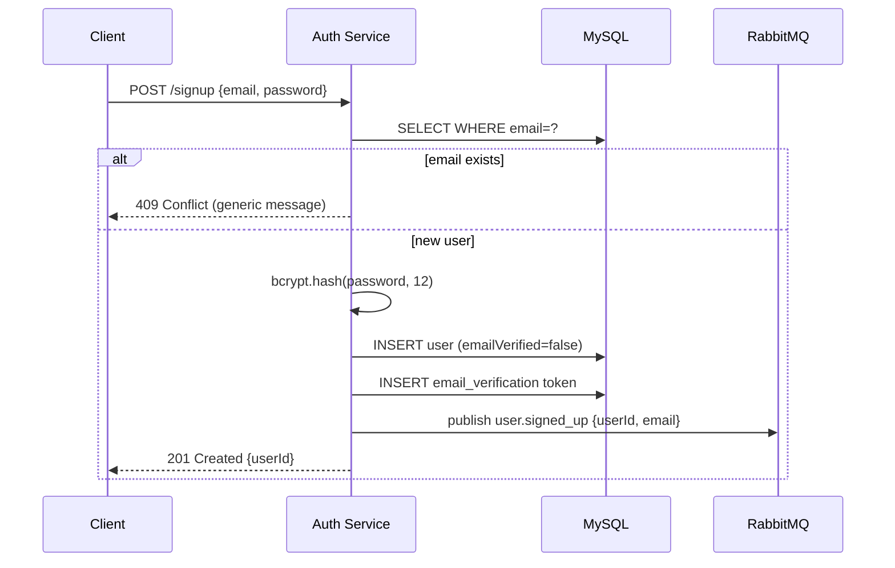

`user.signed_up` is consumed by the User service (create profile row) and Notification service (send verification email) — Auth itself never sends email directly.

### 3.4 Login Flow

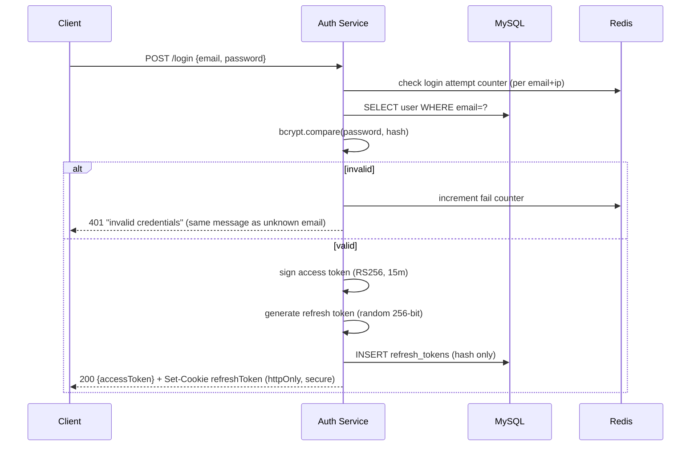

### 3.5 JWT Structure

```ts
// Access token payload (15 min TTL)
interface AccessTokenPayload {
  sub: string; // userId
  email: string;
  roles: string[];
  iat: number;
  exp: number;
  jti: string; // token id, for potential blocklist
}

// Refresh token: opaque random string, NOT a JWT.
// Only its SHA-256 hash is stored in refresh_tokens.tokenHash.
// This means a leaked DB dump can't be used to mint sessions.
```

### 3.6 Refresh Token Rotation

Every `/refresh` call issues a **new** refresh token and immediately revokes the old one (rotation). If a revoked token is ever presented again, it signals theft — the service revokes **all** sessions for that user as a defensive measure.

```ts
async function refresh(oldToken: string) {
  const hash = sha256(oldToken);
  const record = await db.query.refreshTokens.findFirst({ where: eq(tokenHash, hash) });

  if (!record || record.revoked) {
    if (record?.revoked) await revokeAllSessionsForUser(record.userId); // theft detection
    throw new UnauthorizedError();
  }
  if (record.expiresAt < new Date()) throw new UnauthorizedError();

  await db.update(refreshTokens).set({ revoked: true }).where(eq(id, record.id));
  const newRefresh = generateRefreshToken();
  await db.insert(refreshTokens).values({ ...newRow(newRefresh, record.userId) });
  const accessToken = signAccessToken(record.userId);
  return { accessToken, refreshToken: newRefresh };
}
```

### 3.7 Session Management

- `GET /sessions` returns `deviceInfo`, `ipAddress`, `createdAt`, last-used timestamp per active refresh token — lets users see "logged in devices".
- `POST /logout` revokes only the session tied to the current refresh token.
- `POST /logout-all` revokes every refresh token row for the user — used after password reset or suspected compromise.

### 3.8 Password Reset Flow

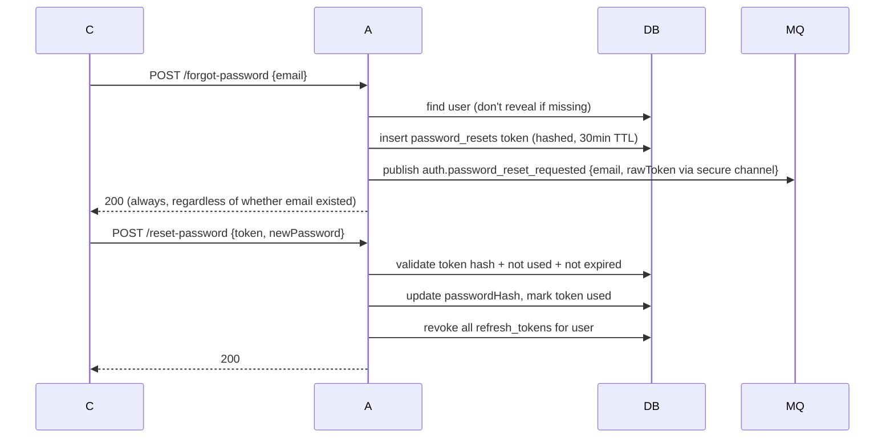

### 3.9 Email Verification Flow

Same pattern as reset: signed, hashed, single-use, short-TTL token emailed via the Notification service after consuming `user.signed_up`. On `/verify-email`, Auth sets `emailVerified=true` and emits `auth.email_verified`.

### 3.10 OAuth Flow (Google)

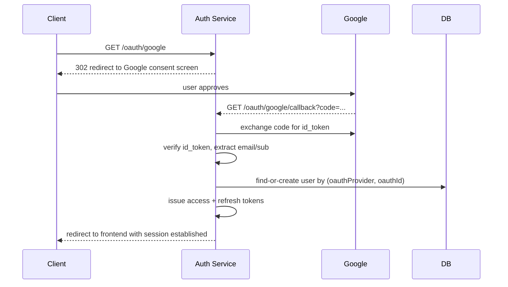

### 3.11 Events Emitted (RabbitMQ)

| Event                           | When                                                       |
| ------------------------------- | ---------------------------------------------------------- |
| `user.signed_up`                | After successful signup                                    |
| `auth.email_verified`           | After email verification                                   |
| `auth.password_reset_requested` | After forgot-password                                      |
| `auth.login_succeeded`          | Every successful login (for audit log / anomaly detection) |
| `auth.login_failed`             | Every failed attempt (for security monitoring)             |

### 3.12 Security Considerations

- **bcrypt, 12 rounds** — tuned so hashing takes ~200-250ms on production hardware; slow enough to blunt brute force, fast enough not to bottleneck login.
- **Enumeration protection** — signup/login/forgot-password all return identical responses/timings whether or not the email exists.
- **Rate limiting** at both Gateway (per-IP) and Auth service (per-email) layers.
- **Refresh token theft detection** as described in 3.6.
- All tokens sent to users (reset/verify) are the **hash** stored server-side; the raw token exists only in the URL sent to the user's inbox and is never logged.

---

## 4. User Service — Complete Design

### 4.1 Endpoints

| Method | Path                    | Purpose                     | Auth |
| ------ | ----------------------- | --------------------------- | ---- |
| GET    | `/users/me`             | Current user's full profile | Yes  |
| GET    | `/users/:id`            | Public profile              | Yes  |
| PATCH  | `/users/me`             | Update profile fields       | Yes  |
| PATCH  | `/users/me/preferences` | Update preferences JSON     | Yes  |
| GET    | `/users/search?q=`      | Meilisearch-backed search   | Yes  |
| POST   | `/users/:id/follow`     | Follow a user               | Yes  |
| DELETE | `/users/:id/follow`     | Unfollow                    | Yes  |
| GET    | `/users/:id/followers`  | List followers              | Yes  |
| GET    | `/users/:id/following`  | List following              | Yes  |

### 4.2 Database Schema (Prisma)

```prisma
model Profile {
  id           String   @id // same as auth userId, no FK across DBs
  email        String   @unique // duplicated from Auth for display/search
  username     String   @unique
  displayName  String?
  bio          String?
  avatarUrl    String?
  preferences  Json     @default("{}")
  createdAt    DateTime @default(now())
  updatedAt    DateTime @updatedAt

  followers    Follow[] @relation("followers")
  following    Follow[] @relation("following")
}

model Follow {
  id          String   @id @default(uuid())
  followerId  String
  followingId String
  createdAt   DateTime @default(now())

  follower    Profile  @relation("following", fields: [followerId], references: [id])
  following   Profile  @relation("followers", fields: [followingId], references: [id])

  @@unique([followerId, followingId])
  @@index([followingId])
}
```

### 4.3 Profile CRUD Flow

Standard REST CRUD; the one nuance is that `Profile.id` is **not** generated here — it's the `userId` from the `user.signed_up` event, keeping the two services' primary keys aligned without a foreign key across databases.

### 4.4 Preferences Handling (JSONB)

Preferences (theme, notification settings, privacy toggles) are stored as a single `Json` column rather than normalized columns, because the shape changes often and isn't queried relationally. Validation happens at the API layer with a Zod schema before the blob is persisted, so garbage never lands in the DB even though Postgres itself won't enforce shape.

```ts
const PreferencesSchema = z
  .object({
    theme: z.enum(['light', 'dark', 'system']).default('system'),
    emailNotifications: z.boolean().default(true),
    pushNotifications: z.boolean().default(true),
    profileVisibility: z.enum(['public', 'followers', 'private']).default('public'),
  })
  .partial();
```

### 4.5 Search Implementation (Meilisearch)

Profiles are pushed into a `profiles` Meilisearch index on create/update (via a small outbox-style hook after the Prisma write). Search endpoint queries Meilisearch directly, not Postgres — full-text + typo tolerance out of the box, sub-50ms latency.

```ts
async function indexProfile(p: Profile) {
  await meili.index('profiles').addDocuments([
    {
      id: p.id,
      username: p.username,
      displayName: p.displayName,
      bio: p.bio,
    },
  ]);
}
```

### 4.6 Follow/Unfollow Logic

Enforced via the `@@unique([followerId, followingId])` constraint — a duplicate follow is caught at the DB level and treated as idempotent success rather than an error. Self-follow is rejected at the API layer.

### 4.7 Events Consumed

| Event                 | From | Action                                             |
| --------------------- | ---- | -------------------------------------------------- |
| `user.signed_up`      | Auth | Create `Profile` row, index in Meilisearch         |
| `auth.email_verified` | Auth | Optionally flag profile as verified badge-eligible |

### 4.8 Events Emitted

| Event                  | To                                                   |
| ---------------------- | ---------------------------------------------------- |
| `user.profile_updated` | Chat (to refresh cached display names), Notification |
| `user.followed`        | Notification (so the followed user gets notified)    |

### 4.9 Caching Strategy (Redis)

- `profile:{id}` → cached JSON, TTL 5 min, invalidated on write.
- Follower/following **counts** cached separately with a short TTL since they're read far more than they change.

### 4.10 Sample Code

```ts
// user-service/src/controllers/profile.controller.ts
export async function getProfile(req: Request, res: Response) {
  const cached = await redis.get(`profile:${req.params.id}`);
  if (cached) return res.json(JSON.parse(cached));

  const profile = await profileService.findById(req.params.id);
  if (!profile) return res.status(404).json({ error: 'not_found' });

  await redis.set(`profile:${req.params.id}`, JSON.stringify(profile), 'EX', 300);
  res.json(profile);
}

// user-service/src/services/profile.service.ts
export const profileService = {
  async findById(id: string) {
    return prisma.profile.findUnique({ where: { id } });
  },
  async update(id: string, data: Partial<Profile>) {
    const updated = await prisma.profile.update({ where: { id }, data });
    await redis.del(`profile:${id}`);
    await indexProfile(updated);
    await publish('user.profile_updated', { userId: id });
    return updated;
  },
};

// user-service/src/repositories/follow.repository.ts
export const followRepository = {
  async follow(followerId: string, followingId: string) {
    return prisma.follow.upsert({
      where: { followerId_followingId: { followerId, followingId } },
      create: { followerId, followingId },
      update: {},
    });
  },
};
```

---

## 5. Chat Service — Complete Design

### 5.1 Endpoints

| Method/Event           | Path                          | Purpose                          |
| ---------------------- | ----------------------------- | -------------------------------- |
| GET                    | `/rooms/:id/messages?before=` | Paginated message history (REST) |
| POST                   | `/rooms`                      | Create a room                    |
| GET                    | `/rooms/dm/:userId`           | Get-or-create a DM room          |
| POST                   | `/rooms/:id/upload-url`       | Get S3 presigned upload URL      |
| WS `connect`           | —                             | Socket.IO handshake with JWT     |
| WS `message:send`      | —                             | Send a message                   |
| WS `message:read`      | —                             | Mark read up to a message        |
| WS `typing:start/stop` | —                             | Typing indicator                 |

### 5.2 Database Schema (Mongoose)

```ts
const RoomSchema = new Schema({
  type: { type: String, enum: ['dm', 'group'], required: true },
  members: [{ type: String, required: true }], // userIds
  name: String, // group rooms only
  lastMessageAt: Date,
  createdAt: { type: Date, default: Date.now },
});
RoomSchema.index({ members: 1 });

const MessageSchema = new Schema({
  roomId: { type: Schema.Types.ObjectId, ref: 'Room', required: true },
  senderId: { type: String, required: true },
  content: { type: String, required: true },
  attachments: [{ url: String, type: String, size: Number }],
  readBy: [{ userId: String, readAt: Date }],
  createdAt: { type: Date, default: Date.now },
});
MessageSchema.index({ roomId: 1, createdAt: -1 });
```

### 5.3 Connection Flow (Socket.IO + JWT)

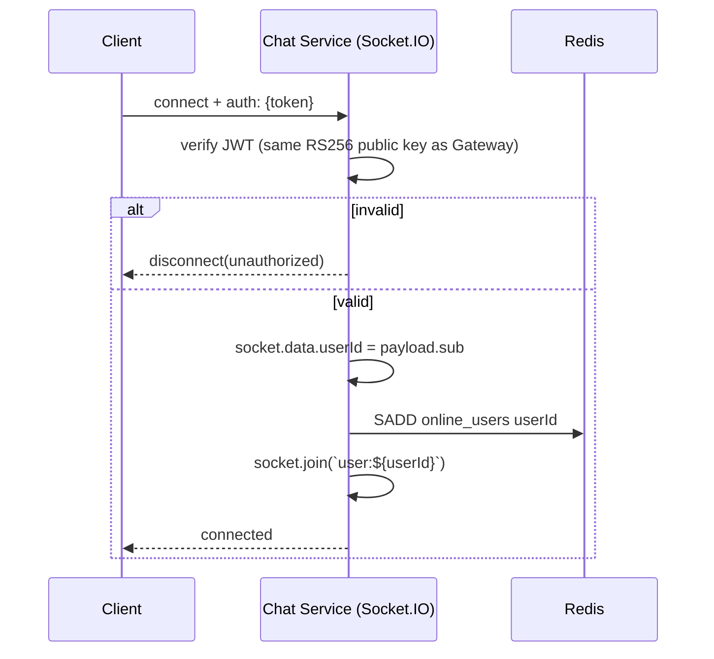

### 5.4 Message Send/Receive Flow

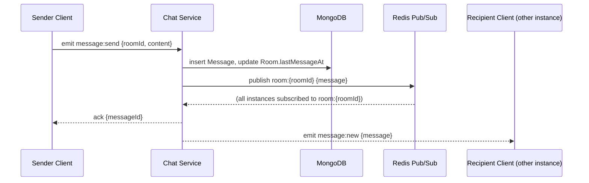

### 5.5 Room Creation Logic

Group rooms: explicit `POST /rooms` with a member list. DM rooms: `GET /rooms/dm/:userId` is idempotent — it finds an existing `type: dm` room with exactly `[me, userId]` as members, or creates one. This avoids duplicate DM threads between the same two users.

### 5.6 Direct Message Flow

DMs reuse the exact same `message:send` path as group messages — a DM is simply a `Room` with `type: "dm"` and 2 members. No separate code path needed.

### 5.7 Read Receipts

`message:read {roomId, messageId}` appends `{userId, readAt}` to every message in the room up to and including `messageId` (bulk update), then broadcasts `message:read_receipt` to the room so other members' UI updates.

### 5.8 Typing Indicator (Redis ephemeral keys)

```ts
// key: typing:{roomId}:{userId}, value: "1", TTL 5s
socket.on('typing:start', async ({ roomId }) => {
  await redis.set(`typing:${roomId}:${userId}`, '1', 'EX', 5);
  socket.to(roomId).emit('typing:update', { userId, typing: true });
});
// No explicit stop event needed for correctness — TTL expiry self-heals
// if the client disconnects mid-type; typing:stop just clears it early.
```

### 5.9 Multi-Instance Scaling (Redis Pub/Sub)

Chat Service runs multiple pods behind the Gateway. Socket.IO's Redis adapter is used so `io.to(room).emit(...)` fans out across **all** pods, not just the one holding the sender's socket:

```ts
import { createAdapter } from '@socket.io/redis-adapter';
const pubClient = redis.duplicate();
const subClient = redis.duplicate();
io.adapter(createAdapter(pubClient, subClient));
```

Sticky sessions are still configured at the Nginx/K8s ingress layer for the initial handshake, but cross-pod message delivery no longer depends on it once the adapter is in place.

### 5.10 File Upload Flow (S3 Presigned URLs)

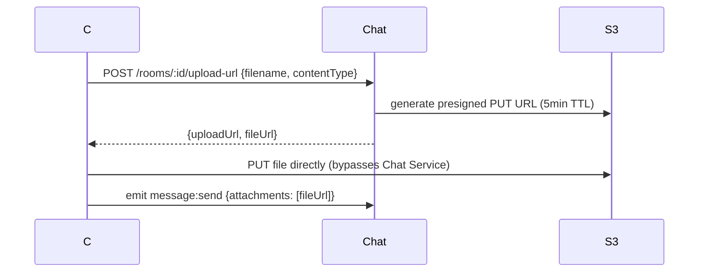

Files never pass through the Chat Service's own bandwidth — client uploads directly to S3/MinIO using the presigned URL, keeping the service stateless and cheap to scale.

### 5.11 Events Consumed / Emitted

| Direction | Event                  | Purpose                                                          |
| --------- | ---------------------- | ---------------------------------------------------------------- |
| Consumes  | `user.profile_updated` | Refresh cached sender display name/avatar on next message render |
| Emits     | `chat.message_sent`    | Notification service (push/email for offline recipients)         |

### 5.12 Sample Code

```ts
// chat-service/src/socket/handlers.ts
export function registerHandlers(io: Server, socket: Socket) {
  const userId = socket.data.userId;

  socket.on('message:send', async ({ roomId, content, attachments }, ack) => {
    const room = await Room.findById(roomId);
    if (!room?.members.includes(userId)) return ack({ error: 'forbidden' });

    const message = await Message.create({ roomId, senderId: userId, content, attachments });
    await Room.updateOne({ _id: roomId }, { lastMessageAt: new Date() });

    io.to(roomId).emit('message:new', message);
    await publish('chat.message_sent', {
      roomId,
      messageId: message.id,
      senderId: userId,
      recipients: room.members.filter((m: string) => m !== userId),
    });

    ack({ messageId: message.id });
  });
}

// chat-service/src/services/message.service.ts
export async function getHistory(roomId: string, before?: string, limit = 30) {
  const query: any = { roomId };
  if (before) query._id = { $lt: before };
  return Message.find(query).sort({ createdAt: -1 }).limit(limit);
}
```

---

## 6. Notification Service — Complete Design

### 6.1 Endpoints

| Method | Path                          | Purpose                        |
| ------ | ----------------------------- | ------------------------------ |
| GET    | `/notifications`              | Paginated in-app notifications |
| PATCH  | `/notifications/:id/read`     | Mark one as read               |
| PATCH  | `/notifications/read-all`     | Mark all as read               |
| GET    | `/notifications/unread-count` | Badge count                    |
| PUT    | `/notifications/preferences`  | Per-channel opt in/out         |

### 6.2 Database Schema (PostgreSQL + Drizzle)

```ts
export const notifications = pgTable(
  'notifications',
  {
    id: uuid('id').primaryKey().defaultRandom(),
    userId: varchar('user_id', { length: 36 }).notNull(),
    type: varchar('type', { length: 64 }).notNull(), // e.g. "chat.message", "user.followed"
    title: varchar('title', { length: 255 }).notNull(),
    body: text('body'),
    data: jsonb('data').default({}),
    read: boolean('read').default(false),
    createdAt: timestamp('created_at').defaultNow(),
  },
  (t) => ({ userIdx: index('user_idx').on(t.userId, t.read) }),
);

export const notificationPreferences = pgTable('notification_preferences', {
  userId: varchar('user_id', { length: 36 }).primaryKey(),
  emailEnabled: boolean('email_enabled').default(true),
  pushEnabled: boolean('push_enabled').default(true),
  mutedTypes: jsonb('muted_types').default([]),
});

export const pushTokens = pgTable('push_tokens', {
  id: uuid('id').primaryKey().defaultRandom(),
  userId: varchar('user_id', { length: 36 }).notNull(),
  fcmToken: varchar('fcm_token', { length: 255 }).notNull(),
  platform: varchar('platform', { length: 16 }),
});
```

### 6.3 Notification Types

| Type                  | Channels                                 | Trigger event                   |
| --------------------- | ---------------------------------------- | ------------------------------- |
| `auth.verify_email`   | Email only                               | `user.signed_up`                |
| `auth.password_reset` | Email only                               | `auth.password_reset_requested` |
| `chat.message`        | Push + in-app (email if offline > 5 min) | `chat.message_sent`             |
| `user.followed`       | In-app + push                            | `user.followed`                 |

### 6.4 Event Consumption from RabbitMQ

| Event consumed                  | Handler                                                                                                             |
| ------------------------------- | ------------------------------------------------------------------------------------------------------------------- |
| `user.signed_up`                | Send verification email                                                                                             |
| `auth.password_reset_requested` | Send reset email                                                                                                    |
| `chat.message_sent`             | Fan out to each offline/backgrounded recipient: push + in-app row; email only if unread after 5 min (delayed check) |
| `user.followed`                 | In-app + push to the followed user                                                                                  |

### 6.5 Email Sending Flow (Resend/SES + templates)

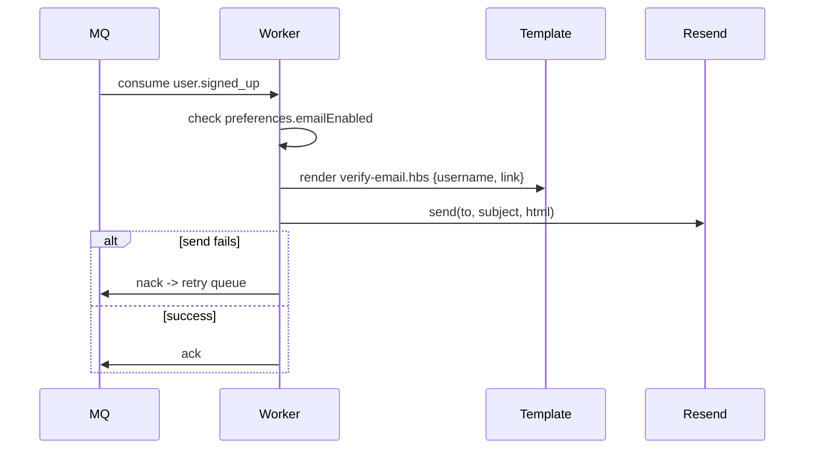

### 6.6 Push Notification Flow (FCM)

```ts
async function sendPush(userId: string, title: string, body: string, data: object) {
  const tokens = await db.query.pushTokens.findMany({ where: eq(pushTokens.userId, userId) });
  if (!tokens.length) return;
  await fcm.sendEachForMulticast({
    tokens: tokens.map((t) => t.fcmToken),
    notification: { title, body },
    data,
  });
}
```

### 6.7 In-App Notification Flow (WebSocket delivery)

Notification service doesn't hold its own WebSocket layer — it inserts the row, then publishes a lightweight `notification.created {userId, notification}` event that the **Chat service's** existing Socket.IO layer relays to `user:{userId}` room (reusing the same realtime transport rather than standing up a second one).

### 6.8 Deduplication Strategy (Redis)

Before creating a notification row, a dedup key is set with `SET key value NX EX 60` — e.g. `dedupe:chat.message:{roomId}:{userId}`. If two rapid messages arrive in the same room within the window, only one push is sent (batched as "3 new messages" instead of 3 separate pushes).

### 6.9 User Preferences Handling

Every send path checks `notificationPreferences` first — muted types and disabled channels short-circuit before any provider is called, so a user who disabled push never even generates an FCM API call.

### 6.10 Retry + DLQ Strategy

Failed sends (provider timeout, invalid token) are `nack`'d with requeue=false, landing in a per-type retry queue with exponential backoff (1m, 5m, 30m via RabbitMQ's `x-delayed-message` or dead-letter TTL pattern). After 3 failed attempts, the message lands in `notifications.dlq` for manual inspection — it does not block the queue for other users.

### 6.11 Sample Code

```ts
// notification-service/src/workers/chatMessage.worker.ts
export async function handleChatMessageSent(event: ChatMessageSentEvent) {
  for (const userId of event.recipients) {
    const online = await isUserOnline(userId); // checks chat-service's Redis online set
    if (online) continue; // they'll see it live, no notification needed

    const prefs = await getPreferences(userId);
    const dedupeKey = `dedupe:chat.message:${event.roomId}:${userId}`;
    const isNew = await redis.set(dedupeKey, '1', 'NX', 'EX', 60);

    await db.insert(notifications).values({
      userId,
      type: 'chat.message',
      title: 'New message',
      data: { roomId: event.roomId, messageId: event.messageId },
    });

    if (isNew && prefs.pushEnabled) {
      await sendPush(userId, 'New message', 'You have a new message', { roomId: event.roomId });
    }
  }
}
```

---

## 7. Event-Driven Communication (RabbitMQ)

### 7.1 Exchange + Queue Topology

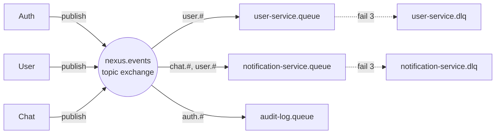

One **topic exchange** (`nexus.events`), routing keys of the form `<service>.<event>` (e.g. `user.signed_up`, `chat.message_sent`). Each consuming service binds its own durable queue with the routing patterns it cares about — this means adding a new consumer never requires touching the publisher.

### 7.2 Event Catalog

| Event Name                      | Publisher | Consumers          | Payload                                       |
| ------------------------------- | --------- | ------------------ | --------------------------------------------- |
| `user.signed_up`                | Auth      | User, Notification | `{userId, email}`                             |
| `auth.email_verified`           | Auth      | User               | `{userId}`                                    |
| `auth.password_reset_requested` | Auth      | Notification       | `{userId, email, resetToken}`                 |
| `auth.login_succeeded`          | Auth      | Audit              | `{userId, ip, ts}`                            |
| `auth.login_failed`             | Auth      | Audit              | `{email, ip, ts}`                             |
| `user.profile_updated`          | User      | Chat, Notification | `{userId}`                                    |
| `user.followed`                 | User      | Notification       | `{followerId, followingId}`                   |
| `chat.message_sent`             | Chat      | Notification       | `{roomId, messageId, senderId, recipients[]}` |

### 7.3 Event Payload Schemas (TypeScript)

```ts
interface UserSignedUpEvent {
  userId: string;
  email: string;
}
interface AuthEmailVerifiedEvent {
  userId: string;
}
interface PasswordResetRequestedEvent {
  userId: string;
  email: string;
  resetToken: string;
}
interface UserProfileUpdatedEvent {
  userId: string;
}
interface UserFollowedEvent {
  followerId: string;
  followingId: string;
}
interface ChatMessageSentEvent {
  roomId: string;
  messageId: string;
  senderId: string;
  recipients: string[];
}
```

### 7.4 Retry + Dead Letter Queue Strategy

Every queue is declared with:

```ts
await channel.assertQueue('notification-service.queue', {
  durable: true,
  arguments: {
    'x-dead-letter-exchange': 'nexus.dlx',
    'x-dead-letter-routing-key': 'notification-service.dlq',
    'x-message-ttl': 60000, // for the retry-delay queue variant
  },
});
```

A message that fails processing is `nack`'d. RabbitMQ routes it through a per-attempt delay queue (1m → 5m → 30m backoff) back to the original queue; after the 3rd failure it lands permanently in the DLQ for manual replay/inspection, so one poison message never blocks the rest of the queue.

### 7.5 Idempotency Handling

Every consumer is written assuming **at-least-once delivery** (RabbitMQ can redeliver on crash/ack-timeout). Handlers use the event's natural key (e.g. `messageId`, or `userId+eventType` for events without one) to upsert rather than insert-blindly, and/or check a `processed_events` table keyed by a message ID header before doing side effects that aren't naturally idempotent (like sending an email).

```ts
async function handleWithIdempotency(msg: ConsumeMessage, handler: () => Promise<void>) {
  const eventId = msg.properties.messageId;
  const already = await redis.set(`processed:${eventId}`, '1', 'NX', 'EX', 86400);
  if (!already) return channel.ack(msg); // seen before, skip silently
  await handler();
  channel.ack(msg);
}
```

### 7.6 Saga Pattern for Signup

If User service fails to create the profile row after `user.signed_up` (e.g. Meilisearch down, DB timeout), the message is retried per §7.4 rather than rolling back Auth's insert — **the user account still exists**, just with a temporarily incomplete profile. A background reconciliation job periodically checks for `users` in Auth with no matching `Profile` row older than N minutes and re-emits the event. This is the pragmatic choice over a full compensating-transaction saga: account creation is not something we want to undo just because a downstream, non-critical write failed.

### 7.7 Sample Code

```ts
// shared/src/messaging/publisher.ts
export async function publish(routingKey: string, payload: object) {
  await channel.publish('nexus.events', routingKey, Buffer.from(JSON.stringify(payload)), {
    persistent: true,
    messageId: randomUUID(),
    timestamp: Date.now(),
    contentType: 'application/json',
  });
}

// notification-service/src/messaging/consumer.ts
await channel.assertExchange('nexus.events', 'topic', { durable: true });
await channel.assertQueue('notification-service.queue', { durable: true, arguments: dlqArgs });
await channel.bindQueue('notification-service.queue', 'nexus.events', 'chat.*');
await channel.bindQueue('notification-service.queue', 'nexus.events', 'user.*');
await channel.bindQueue(
  'notification-service.queue',
  'nexus.events',
  'auth.password_reset_requested',
);

channel.consume('notification-service.queue', async (msg) => {
  if (!msg) return;
  const event = JSON.parse(msg.content.toString());
  try {
    await routeEvent(msg.fields.routingKey, event);
    channel.ack(msg);
  } catch (err) {
    logger.error({ err, routingKey: msg.fields.routingKey }, 'event handling failed');
    channel.nack(msg, false, false); // sends to DLX per queue args
  }
});
```

---

## 8. Database Design Patterns

### 8.1 Why Each Service Owns Its Own Database

| Service      | DB                   | Why this fits                                                                                                                                        |
| ------------ | -------------------- | ---------------------------------------------------------------------------------------------------------------------------------------------------- |
| Auth         | MySQL + Drizzle      | Simple relational rows (users, tokens), strong consistency for credentials, Drizzle's lightweight SQL-first API keeps auth-critical queries explicit |
| User         | PostgreSQL + Prisma  | Relational (follows graph) + JSONB for flexible preferences; Prisma's DX suits a service with many evolving fields                                   |
| Chat         | MongoDB + Mongoose   | Messages are naturally document-shaped, high write volume, flexible schema for attachments                                                           |
| Notification | PostgreSQL + Drizzle | Relational, mostly append-only + status flips; Drizzle keeps queue-worker code lightweight                                                           |

**Database-per-service** is deliberate: it forces every cross-service interaction through an explicit API or event, which is what makes independent deployment and scaling possible. The cost is no cross-service joins or transactions — addressed below.

### 8.2 Cross-Service Data Consistency (No Shared DB)

Any data needed in more than one service (e.g. a user's `email` or `displayName`) is either (a) fetched via the owning service's API at read time, or (b) duplicated locally and kept eventually-consistent via events. NexusCore uses (b) for hot-path data like display names in chat messages, and (a) for cold-path lookups.

### 8.3 Saga vs 2PC (Why Saga Wins)

Two-phase commit would require all four databases to participate in a distributed transaction coordinator — this couples every service's uptime to every other's, defeating the purpose of splitting them, and none of MySQL/Postgres/Mongo/RabbitMQ share a compatible XA setup out of the box anyway. The choreography-based saga (services react to events, with compensating actions or reconciliation jobs for the rare failure case, as in §7.6) trades strict atomicity for availability and independent deployability — acceptable here because none of these flows are financial transactions requiring all-or-nothing guarantees.

### 8.4 Data Duplication Strategy

`email` is written once in Auth (source of truth) and copied into User's `Profile.email` at creation time via `user.signed_up`, kept in sync via `user.profile_updated` if the User service ever lets it be edited (in practice, email changes route back through Auth, which re-emits the event). Duplication is intentional and bounded — only fields actually needed for local queries/search are copied, not the whole user record.

### 8.5 Migration Strategy per DB

- **Drizzle (Auth, Notification):** `drizzle-kit generate` produces SQL migration files checked into git; `drizzle-kit migrate` runs them in CI before the new pod version starts serving traffic.
- **Prisma (User):** `prisma migrate deploy` in the CI/CD pipeline, run as a separate Job before the deployment rollout (see §12).
- **Mongoose (Chat):** schema changes are additive/non-breaking by convention (new optional fields); for structural changes, a versioned migration script using `migrate-mongo` runs as a one-off Job.

### 8.6 Backup + Restore Strategy

| DB                              | Method                                           | Frequency                        | Retention                                                |
| ------------------------------- | ------------------------------------------------ | -------------------------------- | -------------------------------------------------------- |
| MySQL (Auth)                    | `mysqldump` to S3, plus binlog shipping for PITR | Nightly full + continuous binlog | 30 days                                                  |
| PostgreSQL (User, Notification) | `pg_dump` + WAL archiving                        | Nightly full + continuous WAL    | 30 days                                                  |
| MongoDB (Chat)                  | `mongodump` to S3                                | Nightly                          | 14 days (chat history is high-volume, lower criticality) |

Restore drills are run quarterly against a staging cluster to verify backups are actually usable, not just present.

---

## 9. Caching Strategy (Redis)

### 9.1 What to Cache (per service)

| Service      | Cached data                                                    |
| ------------ | -------------------------------------------------------------- |
| Gateway      | Rate-limit counters, JWT public-key cache                      |
| Auth         | Login failure counters, email-verification/reset rate limits   |
| User         | Profile JSON, follower/following counts                        |
| Chat         | Online users set, typing indicators, Socket.IO adapter pub/sub |
| Notification | Dedup keys                                                     |

### 9.2 Cache Key Naming Convention

`<service>:<entity>:<id>[:<field>]`, e.g. `user:profile:abc123`, `chat:typing:room456:user789`, `gw:rl:auth:1.2.3.4`. Consistent prefixing means `redis-cli --scan --pattern "chat:*"` can inspect one service's keys in isolation on a shared cluster.

### 9.3 TTL Values

| Key pattern                             | TTL                                 |
| --------------------------------------- | ----------------------------------- |
| `gw:rl:*` (rate limit counters)         | window length (60s typical)         |
| `user:profile:*`                        | 5 min                               |
| `chat:typing:*`                         | 5 sec                               |
| `dedupe:*`                              | 60 sec                              |
| `auth:login_fail:*`                     | 15 min                              |
| session-adjacent Socket.IO adapter keys | connection lifetime (no manual TTL) |

### 9.4 Cache Invalidation Strategy

Write-through on the owning service: any mutation that changes cached data explicitly `DEL`s the relevant key(s) in the same request/handler that performed the write (see `profileService.update` in §4.10) rather than relying on TTL expiry alone. TTL is a safety net for cases the explicit invalidation misses (e.g. a direct DB edit), not the primary mechanism.

### 9.5 Session Storage

Refresh tokens themselves live in MySQL (need durability + audit trail), but **access-token-adjacent short-lived state** (e.g. an optional server-side revocation blocklist for `jti` values in the rare case of forced logout before natural 15-min expiry) lives in Redis with a TTL matching the token's remaining lifetime.

### 9.6 Rate Limit Counters

Covered in §2.3 — `INCR`/`EXPIRE` pattern, one key per bucket per identity (IP or userId).

### 9.7 Online Users (Chat)

`SADD chat:online_users {userId}` on connect, `SREM` on disconnect. Used by Notification service (§6.11) to decide whether to push or let the live socket handle delivery. Because Chat runs multiple pods, this set is the single shared source of truth for "is this user connected to _any_ pod right now."

### 9.8 Pub/Sub for Real-Time

Socket.IO's Redis adapter (§5.9) uses Redis Pub/Sub under the hood to fan messages out across Chat Service pods — this is separate from the caching uses above but shares the same Redis cluster (different logical DB index in dev, same cluster with key prefixing in production).

---

## 10. Security

### 10.1 JWT Strategy

Access token: 15 minutes, RS256, contains `sub/email/roles/jti`. Refresh token: 7 days, opaque random 256-bit value, stored server-side only as a SHA-256 hash (§3.5–3.6). Short access-token life bounds the blast radius of a leaked token; refresh rotation (§3.6) bounds the blast radius of a leaked refresh token.

### 10.2 Password Hashing

bcrypt, cost factor 12 (§3.12). Never store or log plaintext passwords; password fields are excluded from any request/response logging middleware by explicit allowlist rather than denylist.

### 10.3 Rate Limiting

Layered: Gateway does coarse per-IP/per-user limiting (§2.3); Auth service additionally rate-limits sensitive endpoints per-email regardless of IP, since a distributed attacker can rotate IPs but not target-email.

### 10.4 CORS Policy

Explicit origin allowlist from environment config (§2.7) — never `origin: "*"` when `credentials: true` is set, since that combination is rejected by browsers anyway and signals a misconfiguration if attempted.

### 10.5 Helmet.js Headers

Applied at the Gateway (and defense-in-depth at each service):

```ts
app.use(
  helmet({
    contentSecurityPolicy: { directives: { defaultSrc: ["'self'"] } },
    hsts: { maxAge: 31536000, includeSubDomains: true, preload: true },
    frameguard: { action: 'deny' },
    noSniff: true,
  }),
);
```

### 10.6 SQL Injection Prevention

Handled structurally: Drizzle and Prisma both parameterize all queries by construction — raw string interpolation into SQL is never used anywhere in the codebase (enforced by lint rule banning template-literal SQL). Mongoose similarly builds queries as objects, not string concatenation.

### 10.7 XSS / CSRF Protection

- **XSS:** all user-generated content (bios, message text) is rendered by the frontend through React's default escaping; no `dangerouslySetInnerHTML` on user content. API responses set `Content-Type: application/json` strictly.
- **CSRF:** the refresh-token cookie is `httpOnly`, `secure`, `SameSite=Strict`, and state-changing requests additionally require the `Authorization` header (which cookies alone can't forge cross-site), giving double protection without a separate CSRF token scheme.

### 10.8 Secrets Management (Vault)

All service secrets (DB passwords, JWT signing keys, RabbitMQ credentials, OAuth client secrets) are stored in HashiCorp Vault, injected into pods at startup via the Vault Agent sidecar/init-container pattern rather than baked into images or plain K8s Secrets. Local dev uses `.env` files (git-ignored) with dummy values.

### 10.9 mTLS Between Services

Internal service-to-service traffic (Gateway → services, service → RabbitMQ where supported) runs over mTLS within the cluster via a service mesh (Linkerd or Istio sidecar), so a compromised pod on the same cluster network can't simply call another service's internal endpoints without a valid client cert — this is layered on top of, not a replacement for, the `X-Internal-Secret` header check in §2.5.

### 10.10 Input Validation (Zod Everywhere)

Every REST handler and every Socket.IO event handler validates its input against a Zod schema before touching business logic — malformed input is rejected at the boundary with a 400, never reaches the DB layer.

```ts
const SendMessageSchema = z.object({
  roomId: z.string().uuid(),
  content: z.string().min(1).max(4000),
  attachments: z
    .array(z.object({ url: z.string().url(), type: z.string(), size: z.number() }))
    .max(5)
    .optional(),
});
```

### 10.11 Audit Logging

`auth.login_succeeded` / `auth.login_failed` (§7.2) feed a dedicated audit-log consumer that writes append-only records (never updated/deleted) used for security review and anomaly detection (e.g. many failed logins across many IPs for one email = credential-stuffing signal).

---

## 11. Observability

### 11.1 Structured Logging (Pino + Loki)

Every service logs JSON via Pino, with `requestId`, `userId` (when known), and `service` name on every line. Pino output ships to Loki via Promtail sidecar; Grafana queries logs by `requestId` to reconstruct a full cross-service trace of a single request even without full distributed tracing.

### 11.2 Metrics (Prometheus)

| Metric                          | Type                               | Why                                        |
| ------------------------------- | ---------------------------------- | ------------------------------------------ |
| `http_request_duration_seconds` | Histogram, per route+method+status | Latency/SLO tracking                       |
| `http_requests_total`           | Counter, per route+status          | Error-rate alerting                        |
| `rabbitmq_queue_depth`          | Gauge, per queue                   | Detect consumer falling behind             |
| `websocket_connections_active`  | Gauge                              | Chat service capacity planning             |
| `db_query_duration_seconds`     | Histogram, per operation           | Find slow queries before they page someone |
| `cache_hit_ratio`               | Gauge, per key prefix              | Validate caching is actually helping       |

### 11.3 Distributed Tracing (OpenTelemetry + Jaeger)

Each service is instrumented with the OTel SDK; trace context propagates via the `traceparent` header injected at the Gateway (alongside `X-Request-Id`) and carried through RabbitMQ message headers so async event processing shows up in the same trace as the request that triggered it.

### 11.4 Health Check Endpoints

Every service exposes `/health` (liveness — process is up) and `/ready` (readiness — DB/Redis/RabbitMQ connections are actually healthy), used by Kubernetes probes (§12.2) so a pod that's up but can't reach its database is pulled from the load-balancing rotation instead of receiving traffic it can't serve.

### 11.5 Error Tracking (Sentry)

Unhandled exceptions and explicitly captured errors (e.g. failed payment-adjacent flows, repeated event-processing failures) report to Sentry with the same `requestId`/`userId` tags as the structured logs, so a Sentry alert links directly back to the full log trail.

### 11.6 Alerting Rules (Grafana)

| Alert            | Condition                                                         |
| ---------------- | ----------------------------------------------------------------- |
| High error rate  | `http_requests_total{status=~"5.."}` rate > 2% over 5 min         |
| Queue backing up | `rabbitmq_queue_depth` > 1000 for 10 min                          |
| DLQ growth       | any message lands in a `.dlq` queue → immediate page              |
| p99 latency      | request duration p99 > 1s for any critical route, 5 min sustained |
| Pod not ready    | `/ready` failing for > 2 min                                      |

---

## 12. Deployment

### 12.1 Local Dev — Docker Compose

```yaml
# docker-compose.yml
version: '3.9'
services:
  gateway:
    build: ./services/gateway
    ports: ['3000:3000']
    env_file: ./services/gateway/.env
    depends_on: [auth, user, chat, notification, redis]

  auth:
    build: ./services/auth
    ports: ['3001:3001']
    env_file: ./services/auth/.env
    depends_on: [mysql, rabbitmq]

  user:
    build: ./services/user
    ports: ['3002:3002']
    env_file: ./services/user/.env
    depends_on: [postgres-user, rabbitmq, meilisearch]

  chat:
    build: ./services/chat
    ports: ['3003:3003']
    env_file: ./services/chat/.env
    depends_on: [mongo, redis, rabbitmq, minio]

  notification:
    build: ./services/notification
    ports: ['3004:3004']
    env_file: ./services/notification/.env
    depends_on: [postgres-notif, rabbitmq]

  mysql:
    image: mysql:8
    environment: { MYSQL_ROOT_PASSWORD: devpass, MYSQL_DATABASE: nexus_auth }
    ports: ['3306:3306']
    volumes: ['mysql_data:/var/lib/mysql']

  postgres-user:
    image: postgres:16
    environment: { POSTGRES_PASSWORD: devpass, POSTGRES_DB: nexus_user }
    ports: ['5432:5432']
    volumes: ['pguser_data:/var/lib/postgresql/data']

  postgres-notif:
    image: postgres:16
    environment: { POSTGRES_PASSWORD: devpass, POSTGRES_DB: nexus_notif }
    ports: ['5433:5432']
    volumes: ['pgnotif_data:/var/lib/postgresql/data']

  mongo:
    image: mongo:7
    ports: ['27017:27017']
    volumes: ['mongo_data:/data/db']

  redis:
    image: redis:7-alpine
    ports: ['6379:6379']

  rabbitmq:
    image: rabbitmq:3-management-alpine
    ports: ['5672:5672', '15672:15672']

  meilisearch:
    image: getmeili/meilisearch:v1.9
    ports: ['7700:7700']
    environment: { MEILI_MASTER_KEY: devkey }

  minio:
    image: minio/minio
    command: server /data --console-address ":9001"
    ports: ['9000:9000', '9001:9001']
    environment: { MINIO_ROOT_USER: minioadmin, MINIO_ROOT_PASSWORD: minioadmin }
    volumes: ['minio_data:/data']

volumes:
  mysql_data:
  pguser_data:
  pgnotif_data:
  mongo_data:
  minio_data:
```

### 12.2 Production — Kubernetes (sample manifest, Auth service)

```yaml
apiVersion: apps/v1
kind: Deployment
metadata:
  name: auth-service
spec:
  replicas: 3
  selector: { matchLabels: { app: auth-service } }
  template:
    metadata: { labels: { app: auth-service } }
    spec:
      containers:
        - name: auth-service
          image: registry.example.com/nexus/auth-service:${TAG}
          ports: [{ containerPort: 3001 }]
          envFrom:
            - secretRef: { name: auth-service-secrets }
          livenessProbe: { httpGet: { path: /health, port: 3001 }, periodSeconds: 10 }
          readinessProbe: { httpGet: { path: /ready, port: 3001 }, periodSeconds: 5 }
          resources:
            requests: { cpu: '100m', memory: '128Mi' }
            limits: { cpu: '500m', memory: '512Mi' }
---
apiVersion: v1
kind: Service
metadata: { name: auth-service }
spec:
  selector: { app: auth-service }
  ports: [{ port: 3001, targetPort: 3001 }]
---
apiVersion: autoscaling/v2
kind: HorizontalPodAutoscaler
metadata: { name: auth-service-hpa }
spec:
  scaleTargetRef: { apiVersion: apps/v1, kind: Deployment, name: auth-service }
  minReplicas: 3
  maxReplicas: 10
  metrics:
    - type: Resource
      resource: { name: cpu, target: { type: Utilization, averageUtilization: 70 } }
```

Chat Service's manifest additionally sets `sessionAffinity: ClientIP` on its Service (or uses ingress-level sticky sessions) for Socket.IO handshake stability, per §5.9.

### 12.3 CI/CD Pipeline (GitHub Actions)

```yaml
name: deploy-auth-service
on:
  push:
    branches: [main]
    paths: ['services/auth/**']

jobs:
  test:
    runs-on: ubuntu-latest
    steps:
      - uses: actions/checkout@v4
      - uses: pnpm/action-setup@v3
      - run: pnpm install --frozen-lockfile
      - run: pnpm --filter auth-service test

  migrate:
    needs: test
    runs-on: ubuntu-latest
    steps:
      - uses: actions/checkout@v4
      - run: pnpm --filter auth-service exec drizzle-kit migrate
        env: { DATABASE_URL: '${{ secrets.AUTH_DB_URL }}' }

  build-and-deploy:
    needs: migrate
    runs-on: ubuntu-latest
    steps:
      - uses: actions/checkout@v4
      - run: docker build -t registry.example.com/nexus/auth-service:${{ github.sha }} services/auth
      - run: docker push registry.example.com/nexus/auth-service:${{ github.sha }}
      - run: kubectl set image deployment/auth-service auth-service=registry.example.com/nexus/auth-service:${{ github.sha }}
```

### 12.4 Environment Variables Per Service

| Service      | Key env vars                                                                                           |
| ------------ | ------------------------------------------------------------------------------------------------------ |
| Gateway      | `AUTH_URL`, `USER_URL`, `CHAT_URL`, `NOTIF_URL`, `JWT_PUBLIC_KEY`, `ALLOWED_ORIGINS`, `REDIS_URL`      |
| Auth         | `DATABASE_URL` (MySQL), `JWT_PRIVATE_KEY`, `JWT_PUBLIC_KEY`, `RABBITMQ_URL`, `GOOGLE_CLIENT_ID/SECRET` |
| User         | `DATABASE_URL` (Postgres), `RABBITMQ_URL`, `REDIS_URL`, `MEILISEARCH_URL/KEY`                          |
| Chat         | `MONGO_URL`, `REDIS_URL`, `RABBITMQ_URL`, `JWT_PUBLIC_KEY`, `S3_ENDPOINT/BUCKET/KEYS`                  |
| Notification | `DATABASE_URL` (Postgres), `RABBITMQ_URL`, `REDIS_URL`, `RESEND_API_KEY`, `FCM_CREDENTIALS`            |

### 12.5 Secrets Management in K8s

Secrets are not committed as plain `Secret` manifests; they're synced from Vault into Kubernetes via the External Secrets Operator, so the actual credential values never exist in git or in a `kubectl apply`-able YAML file — only a reference to the Vault path does.

### 12.6 Rolling Deployment Strategy

Default K8s `RollingUpdate` with `maxUnavailable: 0, maxSurge: 1` — a new pod must pass its readiness probe before an old one is terminated, so a bad deploy never drops capacity to zero. Combined with the `/ready` check (§11.4) actually verifying DB connectivity, a pod that can build but can't reach its database never receives traffic.

### 12.7 Database Migration in CI/CD

Migrations run as a **separate CI job** (`migrate` in §12.3) gated between tests and deploy — always additive/backward-compatible (new nullable columns, new tables) so the _currently running_ old pods keep working unmodified against the new schema during the rollout window. Destructive changes (dropping a column) are split into two deploys: stop using it in code first, drop it in a follow-up release once no running pod references it.

---

## 13. Monorepo Structure

### 13.1 Folder Tree

```
nexus-core/
├── package.json
├── pnpm-workspace.yaml
├── tsconfig.base.json
├── docker-compose.yml
├── .github/workflows/
├── services/
│   ├── gateway/
│   ├── auth/
│   ├── user/
│   ├── chat/
│   └── notification/
├── packages/
│   ├── types/          # shared event/DTO interfaces
│   ├── logger/          # Pino wrapper, consistent format
│   ├── messaging/        # RabbitMQ publish/consume helpers
│   ├── config/           # env validation (Zod) per service
│   └── tracing/          # OTel setup helper
└── infra/
    ├── k8s/
    └── terraform/
```

### 13.2 Shared Packages

- `@nexus/types` — every event payload interface (§7.3) and cross-service DTO, so publisher and consumer share the exact type at compile time.
- `@nexus/logger` — pre-configured Pino instance with requestId/service binding.
- `@nexus/messaging` — thin wrapper around `amqplib` implementing the publish/consume/idempotency patterns from §7.5/7.7 once, reused by every service.
- `@nexus/config` — each service imports a Zod schema for its own required env vars and fails fast at boot if one is missing.
- `@nexus/tracing` — one-line OTel bootstrap called at the top of every service's entrypoint.

### 13.3 Per-Service Structure (example: user-service)

```
services/user/
├── src/
│   ├── controllers/
│   ├── services/
│   ├── repositories/
│   ├── middleware/
│   ├── messaging/        # event handlers
│   ├── db/                # Prisma schema + client
│   ├── validation/        # Zod schemas
│   └── index.ts
├── prisma/schema.prisma
├── test/
├── Dockerfile
├── package.json
└── tsconfig.json
```

### 13.4 Naming Conventions

- Packages: `@nexus/<name>`, services: `services/<service-name>` (kebab-case), Docker images: `nexus/<service-name>`.
- Event routing keys: `<service>.<past_tense_verb>` (`user.signed_up`, not `user.signup`).
- Redis keys: `<service>:<entity>:<id>` (§9.2).

### 13.5 Sample package.json (per service)

```json
{
  "name": "@nexus/auth-service",
  "private": true,
  "scripts": {
    "dev": "tsx watch src/index.ts",
    "build": "tsup src/index.ts",
    "test": "vitest run",
    "migrate": "drizzle-kit migrate"
  },
  "dependencies": {
    "@nexus/types": "workspace:*",
    "@nexus/logger": "workspace:*",
    "@nexus/messaging": "workspace:*",
    "drizzle-orm": "^0.33.0",
    "mysql2": "^3.11.0"
  }
}
```

---

## 14. Testing Strategy

### 14.1 Unit Tests (Vitest)

Pure business logic — password validation, token generation helpers, event payload builders, Zod schema edge cases — tested in isolation with all I/O (DB, Redis, RabbitMQ) mocked. Target: every `services/*/src/services/*.ts` file has a co-located `*.test.ts`.

```ts
describe('passwordResetToken', () => {
  it('generates a token whose hash matches stored hash', () => {
    const { raw, hash } = generateResetToken();
    expect(sha256(raw)).toBe(hash);
  });
});
```

### 14.2 Integration Tests (Testcontainers)

Each service's integration suite spins up its real dependencies (MySQL/Postgres/Mongo, Redis, RabbitMQ) via Testcontainers in CI — no mocking the DB layer, so Drizzle/Prisma/Mongoose query correctness is actually verified against a real engine, not an in-memory stand-in that behaves differently.

```ts
const mysqlContainer = await new MySqlContainer().start();
beforeAll(async () => {
  db = drizzle(mysqlContainer.getConnectionUri());
  await migrate(db);
});
```

### 14.3 E2E Tests (Supertest)

Full HTTP flows through a running service instance (signup → verify → login → refresh → logout) hitting real endpoints via Supertest, run against the Docker Compose stack in CI, asserting on actual response shapes and status codes end-to-end.

### 14.4 Load Tests (k6)

```js
// k6/chat-load.js
export const options = { vus: 500, duration: '3m' };
export default function () {
  const res = http.post(`${BASE_URL}/api/chat/rooms/${roomId}/messages`, payload, { headers });
  check(res, { 'status is 200': (r) => r.status === 200 });
}
```

Run against staging before major releases, focused on the Chat service's WebSocket concurrency and the Gateway's rate limiter under real load.

### 14.5 Contract Testing (Pact)

Gateway (consumer) and each service (provider) maintain a Pact contract for their REST interface, verified in each side's CI pipeline — catches a service changing a response shape in a way that would break the Gateway or another consumer, before it ever reaches staging.

### 14.6 Coverage Targets

| Layer                                            | Target                                           |
| ------------------------------------------------ | ------------------------------------------------ |
| Unit (business logic)                            | 80%+                                             |
| Integration (DB/queue-touching code)             | 70%+                                             |
| Critical auth flows (signup/login/reset/refresh) | 95%+, no exceptions                              |
| Overall per-service                              | 75%+ enforced in CI, build fails below threshold |

---

## 15. Scaling Roadmap

### Phase 1 — MVP (current setup, low hundreds of users)

Single replica per service, Docker Compose or a small K8s cluster, all databases single-instance, no read replicas. Bottleneck: none yet — this phase is about correctness, not scale.

### Phase 2 — ~10K users

- Add read replicas for User/Notification Postgres.
- Horizontal Pod Autoscaler on Gateway and Chat (they see the most request volume).
- Redis moves from single instance to a small managed cluster (or Redis Sentinel) for HA.
- **Bottleneck to watch:** RabbitMQ single-node — add a mirrored/quorum queue setup so a broker restart doesn't drop in-flight events.

### Phase 3 — ~1M users

- MongoDB moves to a sharded cluster, sharded on `roomId` — message volume is the first thing to outgrow a single replica set.
- Meilisearch scales via multiple read-only replicas behind the User service.
- Chat Service's Socket.IO layer scales to many pods; Redis adapter (§5.9) becomes the operational bottleneck to monitor — consider splitting Pub/Sub onto its own Redis cluster separate from caching.
- Notification sending volume likely needs a dedicated worker pool separate from the API-serving pods (split `notification-service` into `notification-api` + `notification-worker` deployments).
- **Bottleneck to watch:** Auth's MySQL as every request still verifies via cached JWT (no DB hit), but login/refresh volume at this scale needs read replicas + connection pooling (PgBouncer-equivalent for MySQL, e.g. ProxySQL).

### Phase 4 — ~10M users

- Move from Kubernetes-native RabbitMQ to a managed/clustered event backbone; evaluate Kafka for the highest-volume streams (chat events) while keeping RabbitMQ for lower-volume transactional events — a hybrid, not a full replacement (this aligns with the Kafka mentioned in your broader Nexus platform infra).
- Geo-distributed deployment: Gateway + Chat pods in multiple regions with regional Redis/Mongo, since WebSocket latency becomes user-visible at this scale.
- Database sharding extends to User (shard by `userId` hash) and Notification (shard by `userId`).
- Dedicated observability stack scale-up: Loki/Prometheus retention and cardinality become their own operational concern.
- **Bottleneck to watch:** cross-region event ordering and the "database-per-service, eventual consistency" assumption starts requiring more careful conflict resolution (e.g. last-write-wins with vector clocks for profile updates) as write latency between regions grows.

---

## 16. Implementation Roadmap

### Weeks 1–2: Foundation

- Monorepo scaffold (pnpm workspaces, shared packages skeleton), Docker Compose for all infra (MySQL, Postgres x2, Mongo, Redis, RabbitMQ, Meilisearch, MinIO), CI skeleton (lint + test on PR).

### Weeks 3–4: Auth Service

- Schema + migrations, signup/login/refresh/logout, JWT signing, bcrypt, rate limiting. This unblocks every other service since they all depend on `user.signed_up` and JWT verification.

### Week 5: Gateway

- JWT verification middleware, proxy routing to Auth (only service that exists so far), rate limiting, request ID propagation. Depends on Auth's JWT format being finalized.

### Weeks 6–7: User Service

- Schema + migrations, profile CRUD, consume `user.signed_up`, Meilisearch indexing, follow/unfollow. Depends on Auth emitting events correctly.

### Weeks 8–9: Chat Service

- Schema, Socket.IO + JWT handshake, message send/receive, rooms/DMs, Redis adapter for multi-instance. Depends on Auth (JWT) and User (display names) being stable.

### Week 10: Notification Service

- Schema, RabbitMQ consumers for all existing events, email sending (verify/reset), push scaffolding. Depends on all other services already emitting their events.

### Week 11: Cross-Cutting Concerns

- Observability (logging, metrics, tracing) wired into every service, security hardening pass (Helmet, CORS audit, secrets to Vault), full E2E test suite across the whole flow.

### Week 12: Production Readiness

- Kubernetes manifests, CI/CD pipeline finalized with migration gating, load testing (k6) against staging, runbook/documentation pass, go-live checklist.

### Dependencies Summary

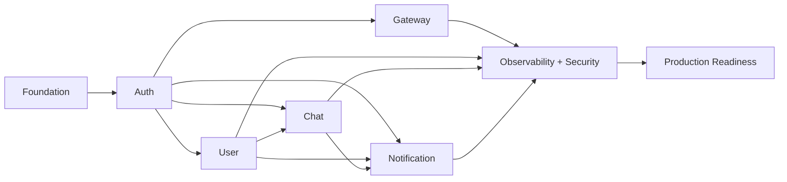

### Milestones

| Milestone              | Target week    | Definition of done                                                             |
| ---------------------- | -------------- | ------------------------------------------------------------------------------ |
| M1: Auth live          | End of week 4  | Signup → login → refresh works end-to-end via Postman                          |
| M2: Gateway routing    | End of week 5  | Client can reach Auth only through Gateway with rate limiting active           |
| M3: Full REST surface  | End of week 7  | Users can sign up, build a profile, search other users                         |
| M4: Realtime chat      | End of week 9  | Two clients can DM each other with read receipts                               |
| M5: Notifications live | End of week 10 | Offline user gets a push for a new message                                     |
| M6: Production-ready   | End of week 12 | Passes load test, full observability, deployed via CI/CD to a real K8s cluster |
